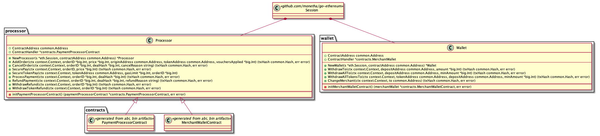

# Monetha: Decentralized Reputation Framework <!-- omit in toc -->

## Payment Layer: go-sdk <!-- omit in toc -->
[](https://godoc.org/github.com/monetha/payment-go-sdk)

A Golang SDK for decentralized Monetha Payment Gateway usage.

- [Building the source](#building-the-source)
	- [Prerequisites](#prerequisites)
	- [Build](#build)
- [Usage](#usage)
	- [Installation & setup](#installation--setup)
- [Contributing](#contributing)
	- [Making changes](#making-changes)
		- [Contracts update](#contracts-update)
		- [Formatting source code](#formatting-source-code)

## Building the source

### Prerequisites

1. Make sure you have Git installed.
2. Install Go 1.12
3. Setup $GOPATH environment variable as described here.
4. Clone the repository:

```bash
mkdir -p $GOPATH/src/github.com/monetha
cd $GOPATH/src/github.com/monetha
git clone git@github.com:monetha/payment-go-sdk.git
cd payment-go-sdk
```

**Note:** You can skip steps 2-3 on Linux and use the official docker image for Go after step 4 to build the project:

```bash
docker run -it --rm \
  -v "$PWD":/go/src/github.com/monetha/reputation-go-sdk \
  -w /go/src/github.com/monetha/reputation-go-sdk \
  golang:1.12 \
  /bin/bash
```

### Build

Install dependencies:

```bash
    make dependencies
```

## Usage

In order to better understand the use cases of the `payment-go-sdk` please refer to [Monetha Payment layer: de-centralized  usage scenarios](https://github.com/monetha/payment-layer#de-centralized-payment-layer-usage-scenarios). There are as well several code sample on how payment-go-sdk can be used in order to complete a full payment by Customer and Merchant which can be found [here](https://github.com/monetha/examples-payment)

### Installation & setup

Install new dependency from you project's folder

```bash
go get github.com/monetha/payment-go-sdk
```

After package is installed import the package in your working file

```golang
import (
    "github.com/ethereum/go-ethereum"
    eth "github.com/mometha/go-ethereum"
    "github.com/monetha/payment-go-sdk/processor"
    "github.com/monetha/payment-go-sdk/wallet"
)
```

Initializing `processor` and `wallet`

```golang

backend, err := ethclient.Dial("ETHEREUM_RPC_URL")
if err != nil {
    // Handle the error
}

e := eth.New(backend, log.Printf)

merchantAccount, err := crypto.HexToECDSA("MERCHANT_PRIVATE_KEY")
if err != nil {
   // Handle the error
}

session = e.NewSession(merchantAccount)

processorContractAddress := common.HexToAddress("PAYMENT_PROCESSOR_CONTRACT_ADDRESS")

processor := processor.NewProcessor(session , processorContractAddress)

walletAddress := common.HexToAddress("MERCHANT_WALLET_ADDRESS")

wallet := wallet.NewWallet(session, walletAddress)
```

- `ETHEREUM_RPC_URL` - Ethereum network node RPC url 
- `MERCHANT_PRIVATE_KEY` - Merchant's Ehereum private key. This address will be covering operational costs
- `PAYMENT_PROCESSOR_CONTRACT_ADDRESS` - PaymentProcessor contract address that is provided by Monetha
- `MERCHANT_WALLET_ADDRESS` - MerchantWallet contract address that is provided by Monetha

**Note**: Currently all PaymentProcessor and MerchantWallet contract instances are provided by Monetha. Contact [team@monetha.io](mailto:team@monetha.io) in case if you would like to have your own instance deployed.

After the following code is initialized you are ready to execute all `processor` and `wallet` methods. All methods will be executed by Merchant's account.

More information on methods available can be found in [godocs](https://godoc.org/github.com/monetha/payment-go-sdk)




## Contributing

Thank you for considering to help out with the source code! We welcome contributions from anyone on the internet, and are grateful for even the smallest of fixes! If you'd like to contribute to `payment-go-sdk`, please fork, fix, commit and send a pull request for the maintainers to review and merge into the main code base.  Feel free to register issues and suggestions.

### Making changes

Make your changes, then ensure that the linters passes:

```bash
    make lint
```

#### Contracts update

This SDK is dependent on [Monetha's payment layer smart contracts](https://github.com/monetha/payment-contracts). In case if contracts will be updated and method signatures will change `contracts/MerchantWallet.go` and `contracts/PaymentProcessor.go` files need to be re-generated. To do so follow the steps below:

1. Copy all necessary smart contract build artifacts of [github.com/monetha/payment-contracts](https://github.com/monetha/payment-contracts) to `contracts/code` folder.
2. Run `go generate` command in `contracts` folder to convert Ethereum contracts into Go package.
3. Commit new/updated files.

#### Formatting source code

`make fmt` command automatically formats Go source code of the entire project.

